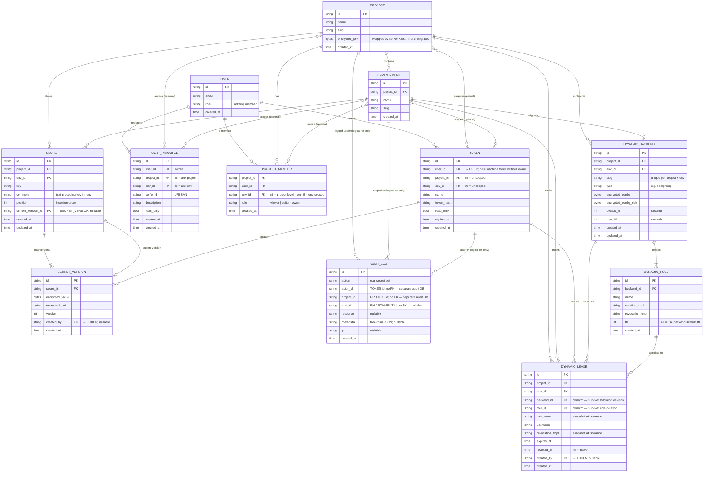

# Entity Relationship Diagram

> Source: [`internal/model/model.go`](../internal/model/model.go)

> **Note on `AUDIT_LOG`**: this entity lives in a physically separate audit database (see `AUDIT_DATABASE_URL` / `AUDIT_WRITE_DATABASE_URL`), not in the main vault DB. Its `actor_id`, `project_id`, and `env_id` columns are plain TEXT — there are no enforced foreign keys. Relationship arrows to PROJECT, ENVIRONMENT, and TOKEN are logical documentation only. Schema is managed by `internal/audit/migrations/` and applied by `vaultd audit-consumer` at startup.

